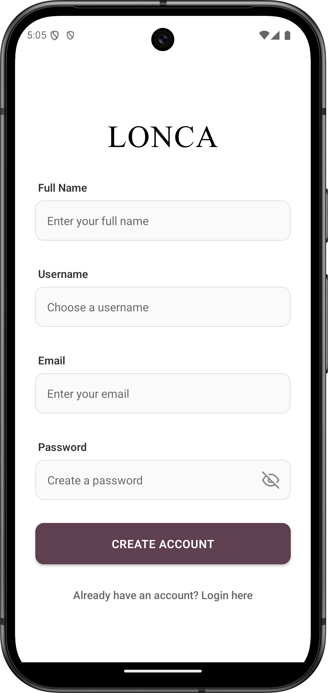
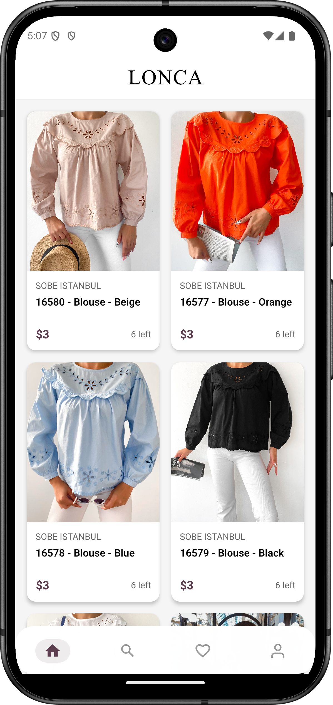
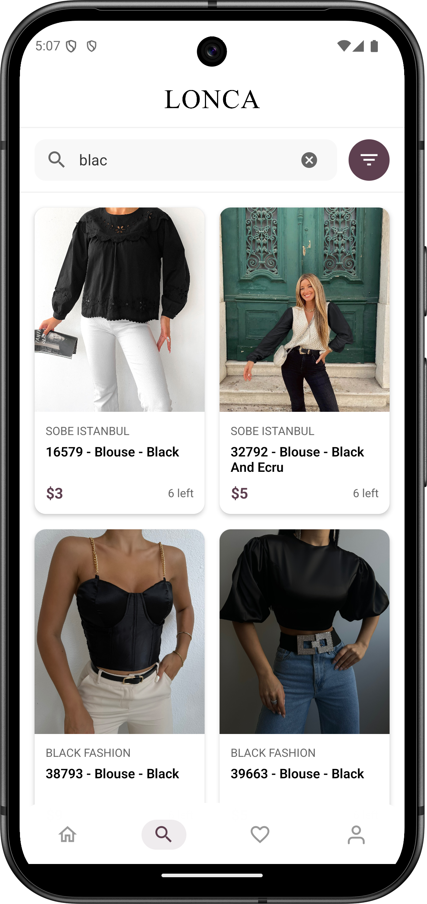
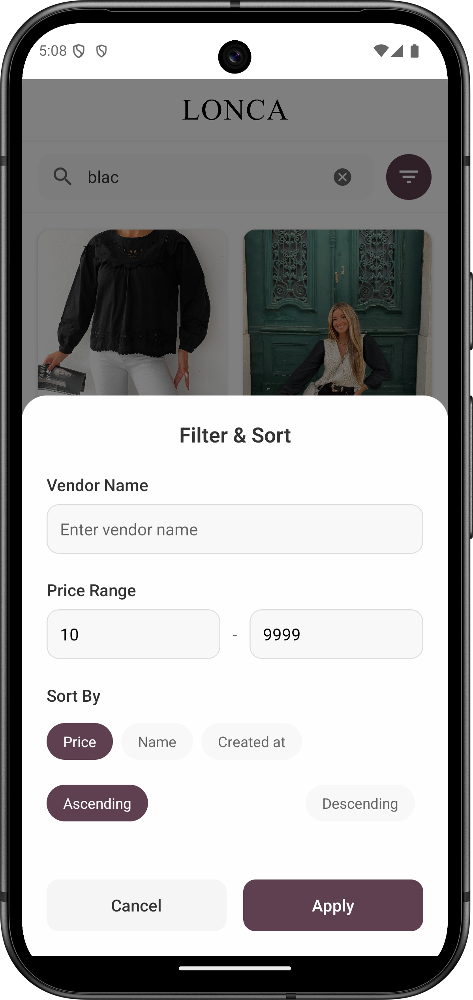
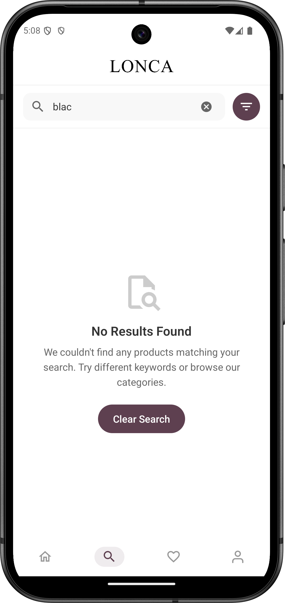
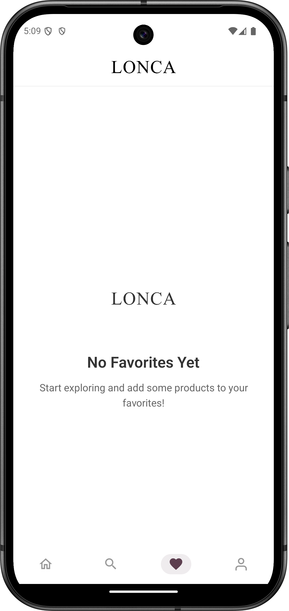
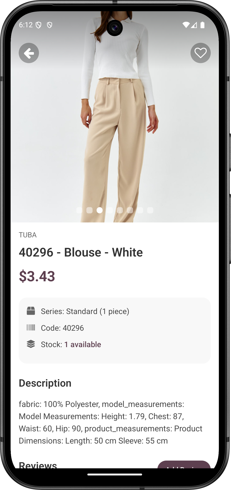

# Lonca Shopping Case

A modern e-commerce mobile application built with React Native and Expo, following Clean Architecture principles.

## 🌟 Features

- Product browsing and detailed view
- Advanced search with filters and sorting
- Favorites management
- User reviews and ratings
- Responsive and animated UI
- Cross-platform support (iOS & Android)

## 🏗 Architecture

The project follows Clean Architecture principles with a feature-based structure:

```
app/
├── features/
│   ├── products/
│   │   ├── data/
│   │   │   └── repositories/
│   │   ├── domain/
│   │   │   ├── models/
│   │   │   └── usecases/
│   │   └── presentation/
│   │       ├── components/
│   │       └── screens/
│   ├── search/
│   ├── favorites/
│   ├── reviews/
│   └── auth/
├── store/
│   └── features/
└── components/
```

### Layer Responsibilities:

- **Data Layer**: Handles data operations and external API communication
- **Domain Layer**: Contains business logic and domain models
- **Presentation Layer**: Manages UI components and screen logic
- **Store**: Centralizes state management with Redux

## 🛠 Technologies

### Core
- React Native (0.76.7)
- Expo (52.0.41)
- TypeScript
- React (18.3.1)

### State Management & Navigation
- Redux Toolkit
- React Redux
- Expo Router

### UI & Animation
- Expo Vector Icons
- React Native Reanimated
- Expo Linear Gradient
- Expo Blur

### Networking & Storage
- Axios
- AsyncStorage

### Development & Testing
- Jest
- TypeScript
- Babel

## 🚀 Getting Started

### Installation

1. Install dependencies:
```bash
npm install
# or
yarn install
```

2. Run on specific platform:
```bash
# For iOS
npm run ios
# For Android
npm run android
```

## 📱 App Structure

### Key Features:
- **Product Management**: Browse, search, and view detailed product information
- **Search System**: Advanced search with filters for vendor, price range, and sorting options
- **Favorites**: Add/remove products to favorites with persistent storage
- **Reviews**: User review system with ratings and comments
- **Responsive Design**: Adaptive UI with smooth animations and transitions

### State Management
- Redux for global state management
- Local state for component-specific data
- AsyncStorage for persistent data

## 🔧 Development

### Code Style
- TypeScript for type safety
- Clean Architecture principles
- Feature-based folder structure
- Component reusability

## Screenshots

| login | register | home | search |
|:-:|:-:|:-:|:-:|
|  |  |  |  |
| filter | notfound | favorites | empty favorites |
|  |  |  |  |
| profile | prodDetail |   |   |
|  |  |   |   |
